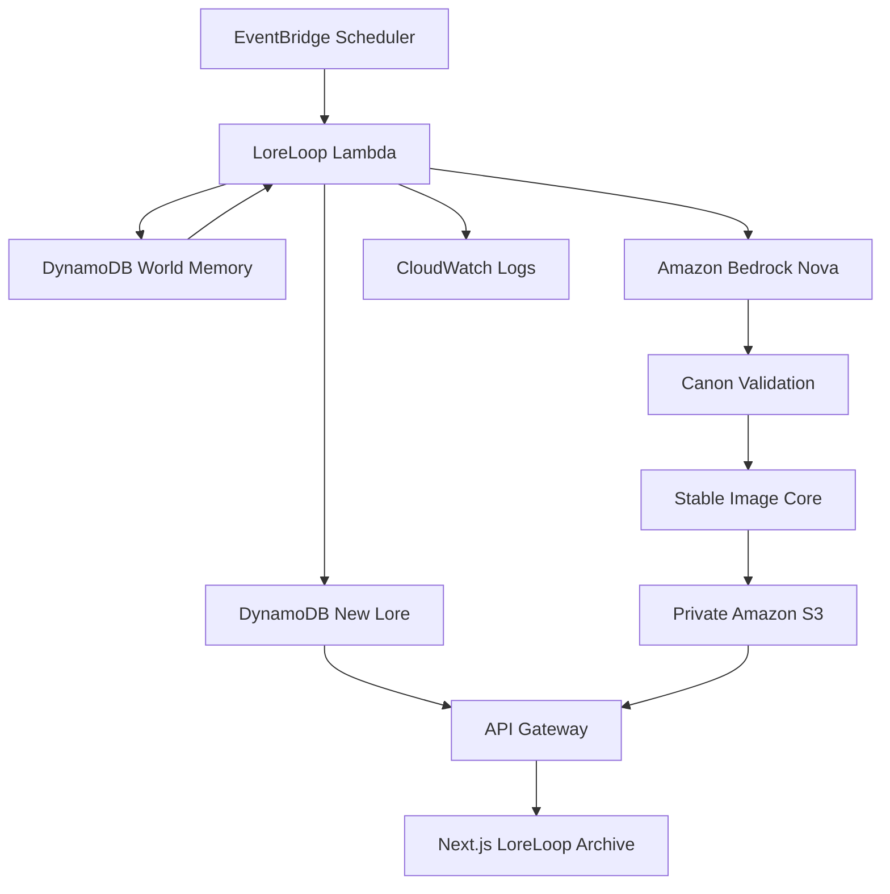

# LoreLoop

## A fictional world that keeps writing itself.

LoreLoop is an autonomous worldbuilding agent for the AWS Builder Center Weekend Creative Agent Challenge. It maintains one persistent fictional universe, wakes on an EventBridge schedule, reads its existing canon, decides what should develop next, writes a new lore entry with Amazon Bedrock Nova, validates the result against the world memory, generates artwork with Stable Image Core, and publishes the result to a read-only archive.

There is no primary Generate button. The product is the loop: memory → creative decision → canon check → publication → memory.

## What is included

- Scheduled autonomous generation through Amazon EventBridge Scheduler and AWS Lambda.
- Compact world state plus canon entities in a DynamoDB single-table design.
- Structured Bedrock JSON generation, repair, and lightweight canon validation.
- Stable Image Core artwork stored in a private, encrypted S3 bucket.
- Public read-only API routes through API Gateway.
- A responsive Next.js editorial frontend with world archive, timeline, lore detail, memory, activity, and architecture pages.
- Structured CloudWatch logs and public activity records for challenge evidence.
- Curator signals that let readers add questions, threads, or moods to the memory considered by the next awakening.
- SAM infrastructure, tests, local event, and challenge documentation.

## Architecture



The backend uses AWS SAM only. It does not mix SAM with CDK or Terraform.

## Repository structure

```text
.
├── backend
│   ├── src/agent       # scheduled worldbuilding workflow
│   ├── src/api         # read-only API handler and route exports
│   ├── src/shared      # config, DynamoDB, Bedrock, S3, validation, types
│   ├── template.yaml   # SAM resources and scheduler
│   └── tests
├── frontend
│   ├── app              # Next.js App Router pages
│   ├── components       # editorial UI components
│   └── lib              # API client, types, formatting
└── docs
```

## Prerequisites

- Node.js 22 and npm.
- AWS CLI and AWS SAM CLI configured with an AWS profile.
- An AWS account with Amazon Bedrock model access enabled in the deployment region.
- Access to an Amazon Nova text model. The default is `amazon.nova-lite-v1:0` and can be changed at deploy time.
- Access to Stable Image Core in us-west-2 if artwork generation is enabled.

The Lambda uses its execution role. Do not put AWS access keys in `.env` files or the frontend.

## Local setup

```bash
git clone REPOSITORY_URL
cd LoreLoop

cd backend
npm install
npm run typecheck
npm test

cd ../frontend
npm install
npm run dev
```

Without `NEXT_PUBLIC_API_BASE_URL`, the frontend intentionally shows a clear unconfigured archive state. It does not fabricate lore.

## Deploy the backend

```bash
cd backend
npm install
npm run build
PATH="./node_modules/.bin:$PATH" sam build
sam deploy --guided
```

Recommended guided values:

- Stack name: `loreloop`
- Region: the region where Bedrock access is enabled
- `WorldName`: `Aethra` (or another fictional world name)
- `GenerationSchedule`: `rate(15 minutes)` while gathering evidence, then `rate(3 hours)` for the production challenge deployment
- `EnableImageGeneration`: `true` for the final demo; `false` for cheaper text-only development
- `NovaTextModelId`: a model ID enabled in the account
- `NovaImageModelId`: `stability.stable-image-core-v1:1`
- `ImageModelRegion`: `us-west-2`

The stack outputs the API base URL, DynamoDB table, S3 bucket, Lambda function, and scheduler name. Copy the API URL for the frontend.

To seed only the compact world state manually, configure the deployed table variables and run:

```bash
npm run build
node dist/src/scripts/seedWorld.js
```

The first autonomous run can also create the state record automatically.

## Run the frontend against the API

Create `frontend/.env.local`:

```bash
NEXT_PUBLIC_API_BASE_URL=https://YOUR_API_ID.execute-api.YOUR_REGION.amazonaws.com/Prod
```

Then:

```bash
cd frontend
npm install
npm run dev
```

For a production build:

```bash
npm run build
npm run start
```

Amplify Hosting is a suitable deployment target for the `frontend` directory. The backend remains AWS SAM-managed.

## Environment variables

Backend values are injected by SAM; see [`backend/.env.example`](backend/.env.example).

```text
AWS_REGION=us-east-1
WORLD_ID=main
WORLD_NAME=Aethra
LORE_TABLE_NAME=LoreLoopWorld
ARTWORK_BUCKET_NAME=...
NOVA_TEXT_MODEL_ID=amazon.nova-lite-v1:0
NOVA_IMAGE_MODEL_ID=stability.stable-image-core-v1:1
IMAGE_MODEL_REGION=us-west-2
GENERATION_SCHEDULE=rate(3 hours)
RECENT_LORE_LIMIT=20
ENABLE_IMAGE_GENERATION=true
ARTWORK_URL_BASE=
```

`ARTWORK_URL_BASE` should point to a read-only CloudFront or other controlled delivery layer if the public UI should display generated S3 objects. The S3 bucket itself blocks public access.

## API

All responses use `{ "data": ..., "error": null }` for success and `{ "data": null, "error": { "message": "..." } }` for failure.

```text
GET /lore?limit=20
GET /lore/{id}
GET /timeline
GET /world/stats
GET /world/memory
GET /agent/status
GET /agent/activity
```

There is intentionally no public POST generation endpoint. Generation is scheduler-driven.

Readers can send a signal through `POST /influence`. A signal is stored as world memory and considered during a later scheduled run. It never starts generation immediately, which keeps the autonomous behavior visible while giving people a meaningful role in the system.

## Current deployment

Live site: https://main.dtzolh2gx99cy.amplifyapp.com/

API base: https://wcp41h7f19.execute-api.us-east-1.amazonaws.com/Prod

The production stack is `loreloop` in `us-east-1`. Its enabled scheduler is `LoreLoop-Autonomous-main` with a `rate(3 hours)` expression. Artwork uses the active Stable Image Core model in `us-west-2`, is stored privately in S3, and is delivered through temporary signed links from the API. Text generation, persistent memory, canon validation, API publication, image generation, and scheduled runs are active.

## Development verification

```bash
cd backend
npm run typecheck
npm test
npm run build
PATH="./node_modules/.bin:$PATH" sam build
sam local invoke LoreLoopAgentFunction --event events/agent.json
```

The local invoke requires AWS credentials, DynamoDB/S3 resources, and Bedrock access configured for the environment. A development event is marked `DEVELOPMENT_TEST`; a Scheduler invocation is marked `AUTONOMOUS_SCHEDULE`.

For the challenge proof, deploy with `rate(15 minutes)`, leave the application alone, and wait for at least three scheduled runs. Verify the run records in CloudWatch and DynamoDB, then switch the production stack to `rate(3 hours)`.

## Cost and safety notes

- DynamoDB uses on-demand billing.
- Image generation can be disabled during development.
- Stable Image Core is billed per generated image, so one image is created per lore entry.
- Lambda is sized for the Bedrock image workflow with a bounded 180-second timeout.
- Text generation, JSON repair, canon retry, and artwork retry loops are capped.
- IAM grants the agent only DynamoDB, S3 write, Bedrock invoke, and logging permissions.
- Generated content is instructed to remain suitable for a public demonstration.
- No secrets, credentials, chain-of-thought, or raw prompts are stored in public records.

## Challenge evidence

See [`docs/challenge-proof.md`](docs/challenge-proof.md) for the screenshot checklist and [`docs/builder-center-article.md`](docs/builder-center-article.md) for the article draft structure.

## License

MIT.
